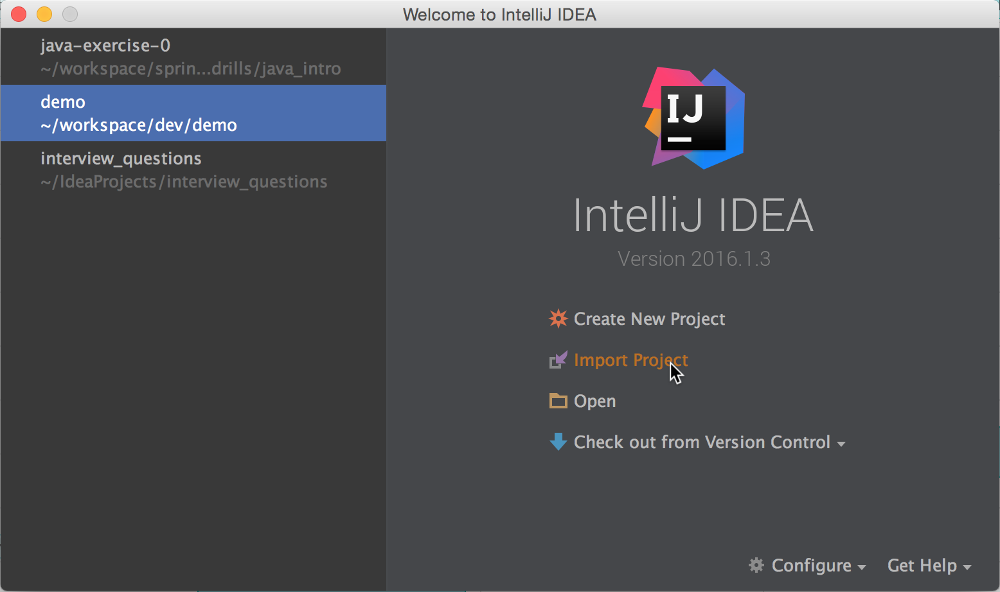
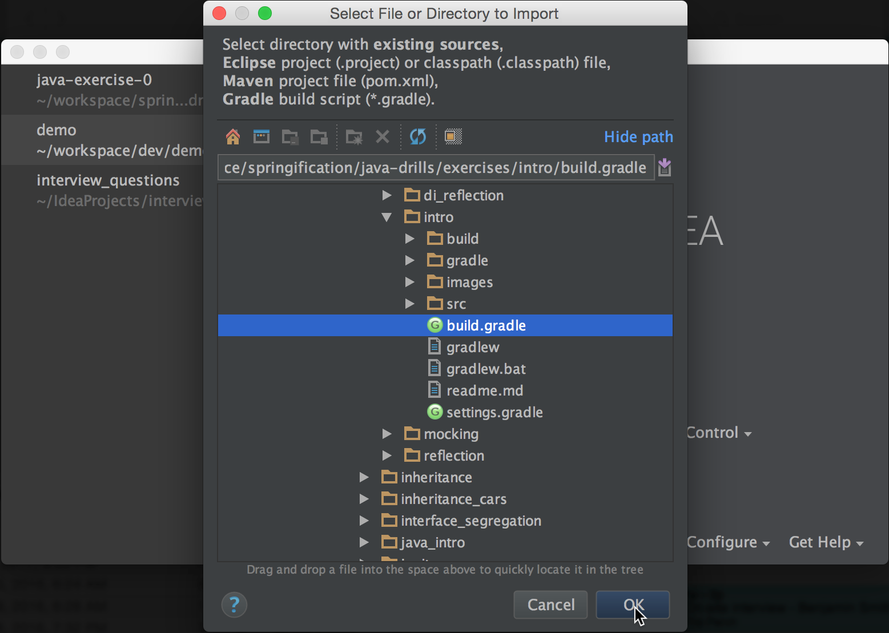
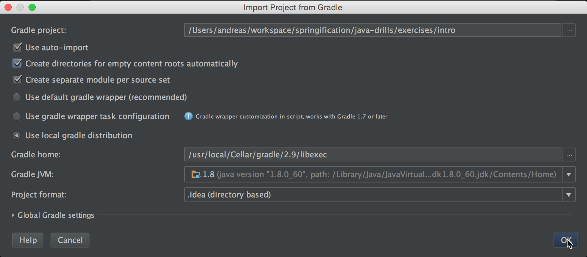

# Counting Letters with Java

## Background

As we go through the course, we will be learning to solve complex problems in Java, but let's start with a simple one. Today we will build a class to count letters in arbitrary words. First, let's set up a new Java project.

## Setup

### Cloning with `git`

Begin by forking the repository from which you'll be working. The "Fork" button is located in the upper right-hand corner of the repository's Github page. Once complete, you'll arrive at your Forked repository's Github page. There you'll find the link to the git repository by clicking the 'Clone or Download' button.

To set up your repository using HTTPS:

    git clone https://github.com/<your Github username>/java-drills.git

Or, using SSH:

    git clone git@github.com:<your Github username>/java-drills.git

Once you have cloned the repository, run the following command to verify the repository was successfully cloned:

    git config -l

In the output verify that the following line exists:

    remote.origin.url=git@github.com:<your Github username>/java-drills.git

Finally, create a branch in which you will do your work:

    git checkout -b solution


### Creating a gradle project

Use `gradle init` to create a new gradle project:

```
gradle init --type java-library
```

Then verify it builds on the command line:

```
gradle build
```

### Importing into IntelliJ

Now that we've proven things are good on the Gradle side of things, let's import the project into IntelliJ. There are many steps, so go slowly and ask for help if you need it. First open IntelliJ, then click "Import Project":



IntelliJ will let you browse for folders or files. Find the *folder* that contains the `build.gradle` file and select the `build.gradle` file then click "OK":



Finally, it will show you a screen with several Gradle-specific options. Be sure to select:

* "Use auto-import"
* "Create directories for empty content roots automatically"
* "Use local gradle distribution"



Next, you should see a pop up message saying "Unregistered VCS root detected". This is IntelliJ trying to tell us that our project is under source control. If you miss the popup, don't worry, just click the event log button in the lower right, then "Add root":


Next, you'll want to create a `.gitignore` file so we don't check in generated files from Gradle and IntelliJ. Click `File -> New -> File` and call it `.gitignore`. Once you have this, ignore the standard files generated by gradle & IntelliJ:

```
# gradle
gradle/
.gradle/
gradlew*
build/

# IntelliJ
*.ipr
*.iml
*.iws
.idea/
```

If you navigate into the `src/` directory, you'll see Gradle has been nice enough to create a `Library` class, and a test (`LibraryTest`). If you right click on that test, you should see an option to "Debug LibraryTest", which you should click, and observe the output:


Now that we can build and run our tests, let's get to work on a problem!


## Problem

For this problem you will make an application that outputs the count of letters of words given as command line arguments to your application. By the end of this Problem, you will be able to run your application with:

```
java -jar build/libs/intro.jar best friends
```

and observe the output:

```
0 [main] INFO App - best=4
0 [main] INFO App - friends=7
```

Since we have not yet covered Integration Testing, a working application will be the sign of success and we will build it as a shell, implementing the behaviors with TDD and Unit Testing.

### Steps

1. Create a class in `src/main/java` named `App` with a `void main()` method
1. Add a constructor to `Library` that accepts an array of Strings
1. In `App` create a new instance of `Library`, and pass it the command line args provided to `main`
1. Create a test that instantiates `Library` and passes it the argument `new String[] {"hello", "world"}`. Be sure to follow the SEAT pattern and determine "expected" and "actual".
1. Add a method to `Library` called `getLetterCounts()` that *accepts no parameters*, and returns a `List<Integer>` containing the number of letters in each command line argument. Use SEAT and figure out what the counts should be yourself, don't just paste the output into "expected".
1. Do a Google search for `"maven slf4j-simple"` and add it as a dependency
1. Add code to `main()` to log each word and its corresponding count
1. Alter your word counter treat certain words differently: if the word is "secret", "hidden", or "shhh" then the count should be `-1`. Be sure to write a test first!

## UI

Finally, to make the app runnable, add the following lines to your build.gradle:

```
jar {
    manifest {
        attributes "Main-Class": "App"
    }
    from {
        configurations.compile.collect { it.isDirectory() ? it : zipTree(it) }
    }
}
```

_Note:_ If you're using Gradle 4, add these lines to your build.gradle:

```
jar {
    manifest {
        attributes "Main-Class": "App"
    }
    from {
        configurations.runtimeClasspath.collect { it.isDirectory() ? it : zipTree(it) }
    }
}

```

Then build a jar:

```
gradle jar
```

Then run it from the command line:

```
java -jar build/libs/intro.jar hello there
```

and observe the output:

```
0 [main] INFO App - hello=5
0 [main] INFO App - there=5
```

### Stretch

If you complete the exercise early, and you have passing tests, pick one of the following sites and complete as many challenges in Java as you can:

  1. [Codewars](http://www.codewars.com/)
  1. [Coderbyte](https://coderbyte.com/challenges)

## Assessment

Typically, Galvanize will provide information on an automated assessment here. For this assignment, you are on the honour system:

1. Did you complete all of the instructions under the `Problem` heading?
1. Did you write your tests first, then write your code?
1. Does your app run from the command line as well as passing tests?
1. Did you and your pair take turns at the keyboard?
1. Did you effectively communicate with your pair?

## Submitting your work

After you have completed the assessment, be sure to push your changes:

    git add .
    git commit -m "Completed Assessment"
    git push origin solution
