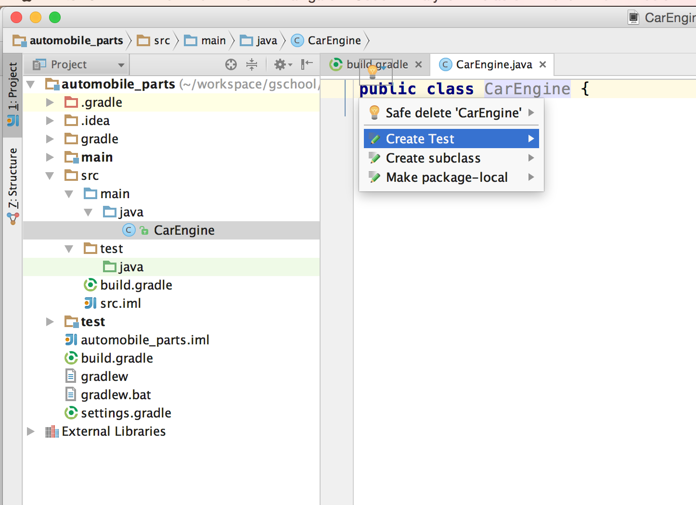
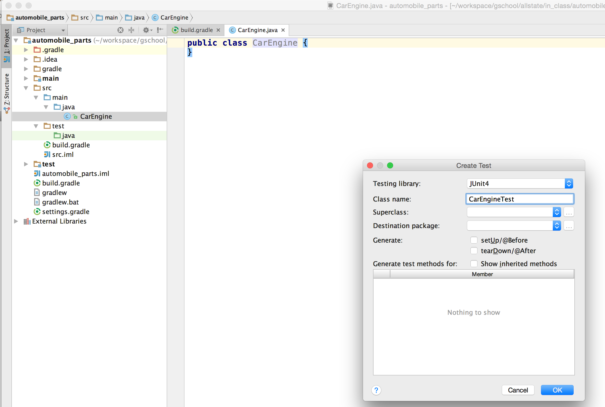

# Inheritance with Java

## Introduction

In this exercise you will **begin by implementing a few concrete classes** and **then refactor the common code** between them into a parent (super/base) class. All of the work in this exercise will be related to automotive parts.

Let's look at a few examples of [automotive parts](https://en.wikipedia.org/wiki/List_of_auto_parts#Engine_components_and_parts):

  1. A car engine has a `manufacturer`, `partNumber`, `description`, `displacement`, `compressionRatio`. Car engines may be either a `DieselEngine` or a `PetrolEngine`. The engine itself is just one of many Engine Components.
  1. A radiator has a `manufacturer`, `partNumber`, `description`, and `coolantPressure`. Radiators are part of the Cooling System for a car.
  1. Another component of the Cooling System for a car is the fan blade. A fan blade has a `manufacturer`, `partNumber`, `description`, `numberOfBlades`, and `diameterInCentimeters`.
  1. The camshaft is another Engine Component. It has a `manufacturer`, `partNumber`, `description`, `duration`, `lift`, and `timing`.

## Your Tasks

Complete each of the following tasks in order. At all points in this exercise you should be using TDD:

1. For each of the components outlined in the _Introduction_ section above, create a Java class. Begin by first doing this in a flat structure. Every class you write should have these methods:

  1. `fullDescription` - returns a `String` containing all of the attributes of the instance of that class listed. For example an instance of `Radiator` would return something like: `"manufacturer: Nissen Automotive, partNumber: 17117507972, description: The full-aluminum radiators from Nissens are produced on the basis of the latest and most advanced technologies, including fully automatic manufacturing and assembly lines, coolantPressure: 250 Pa"`
  1. `coolingSystemComponent` - returns a boolean indicating whether or not an instance of the class is a cooling system
  component.
  1. `engineComponent` - returns a boolean indicating whether or not an instance of the class is an engine component.

2. Refactor your code to use inheritance. Add tests for any Base classes that are introduced in this refactoring.

## Setup

This project will use the [IntelliJ IDE](https://www.jetbrains.com/idea/) and start from scratch with a fresh Gradle project.

#### Creating a test

To create your first test, right click on `main/java` and select "New -> Java Class". In the dialogue to name the class, enter the name of the Java class (implementation, not test) that you would like to create. Once you have made the Java class, hover over the name, click on the Yellow lightbulb and select "Create Test" like so:

In the dialogue be sure to select "JUnit 4" as the Testing Library:

Click "OK" and you have now set up your first test file.
